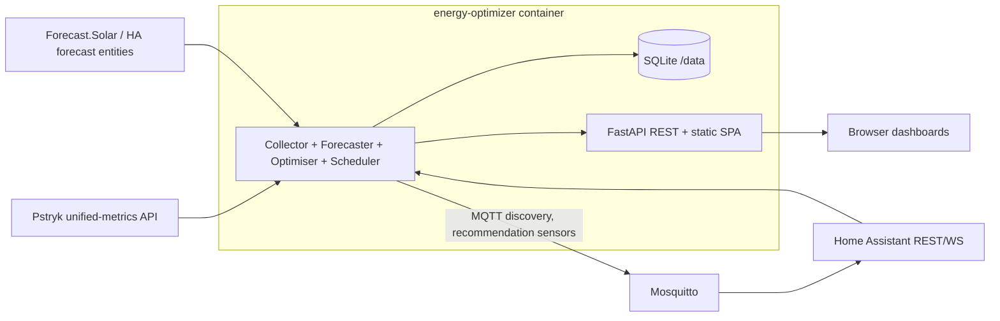

# Energy Optimizer — refined plan and design

Status: designed, not started (2026-07-12)

Refines the KB note [Dockerised solar battery optimisation app](https://kb.korta.top/reference/home/dockerised-solar-battery-optimisation-app).
The app is developed in its **own repository** (working name: `energy-optimizer`), shipped as a
Docker image, and later integrated into ansible-nas as a thin Docker role. This document is the
implementation-ready design; it can be copied into the new repo as `DESIGN.md`.

## Review findings vs the KB note

The KB plan is sound: dry-run first, explainability, backtesting, and the oracle backtest already
shows the upside comes from battery export into evening price peaks. The following corrections and
refinements were found during review:

1. **Pstryk API changed on 2026-04-01.** The legacy `integrations/pricing/` and
   `integrations/prosumer-pricing/` endpoints no longer exist. The current API is a single
   unified-metrics endpoint (verified against evcc's fixed integration and the Pstryk swagger):

   ```
   GET https://api.pstryk.pl/integrations/meter-data/unified-metrics/
       ?metrics=pricing&resolution=hour
       &window_start=2026-07-12T00:00:00Z&window_end=2026-07-14T00:00:00Z
   Authorization: <raw api key, no Bearer prefix>
   ```

   Response: `{ "frames": [...], "summary": {...} }`, with prices in
   `frames[].metrics.pricing.price_gross` (buy) and `.price_prosumer_gross` (sell), plus
   `is_cheap` / `is_expensive` flags. Windows are UTC; convert to Europe/Warsaw locally.
   Swagger: `https://api.pstryk.pl/integrations/swagger/`.

2. **Price horizon is asymmetric and the plan must handle it.** Day-ahead TGE fixing publishes
   tomorrow's hourly prices in the early afternoon (~13:00–15:00 CET). Before publication the
   known-price horizon can be as short as ~10 h. The optimiser must (a) run on whatever horizon has
   real prices, and (b) optionally pad beyond it with a price *forecast* (median-by-hour of last
   7 days) explicitly marked low-confidence. Never present padded hours as real prices in the UI.

3. **Negative prices happen** (sunny PL summer middays). The model must support: PV curtailment as
   a decision variable, avoiding export when sell price ≤ 0, and grid-charging when buy price is
   negative/very low. This also forces MILP (binary) treatment of simultaneous charge/discharge —
   with negative prices, a pure LP can "burn" energy by charging and discharging at once.

4. **Long-term telemetry gap (action item in AnsibleNasConfigs, independent of the app).**
   `homeassistant_influxdb_include_entities` in `HpeNas/group_vars/nas/homeassistant.yml` contains
   no Sigen entities, and the HA recorder keeps only 14 days. Add the Sigen plant sensors (SoC,
   battery/PV/consumed/grid import/export power, EMS mode) to the InfluxDB include list **now** so
   load/PV history accumulates for forecasting and backtests (bucket `ha_raw`, 730d retention).

5. **MQTT is the right HA output path**, not REST sensors. Mosquitto already runs on HpeNas next
   to HA. Use MQTT discovery so sensors appear automatically with availability tracking (LWT), and
   the app needs no inbound access from HA.

6. **LP/MILP over dynamic programming.** The backtest used DP with 0.2 kWh SoC discretisation.
   For the product, use a MILP solved with HiGHS (via `pulp` or `highspy`): continuous SoC, exact
   constraint handling, trivially extensible (flexible loads, reserve penalties), and a 48-step
   hourly problem solves in milliseconds. Keep the DP only if a solver dependency proves painful.

7. **Distribution fees belong in the buy price.** `price_gross` is the energy price; the true
   marginal import cost includes variable distribution components (dystrybucja, quality fee, OZE,
   etc. per the OSD tariff). Model as a configurable `distribution_markup_pln_kwh` (flat or
   hour-banded) added to buy price. Getting this wrong biases grid-charging decisions. Verify
   against an actual invoice during dry-run.

8. **Settlement semantics stay an open question but are contained.** Whether
   `price_prosumer_gross` applies exactly to battery-sourced export, and how the prosumer deposit
   nets against the invoice, must be verified against a real invoice before controlled mode. Until
   then the savings dashboard shows both "raw hourly" and "invoice-model" valuations.

## System context

| Asset | Value |
|---|---|
| PV | ~7 kWp, observed peak ~5.75 kW |
| Battery | Sigen, 18.08 kWh rated, 8.8 kW charge / 9.6 kW discharge limits |
| HA | `http://dom.korta.top:8123`, Sigenergy-Local-Modbus (HACS) entities live |
| Pricing | Pstryk, hourly dynamic, unified-metrics API |
| Infra | HpeNas: HA, Mosquitto, InfluxDB (`ha_raw`), Traefik, ansible-nas managed |

Key HA entities (read-only in MVP):

```
sensor.sigen_plant_battery_state_of_charge
sensor.sigen_plant_battery_power
sensor.sigen_plant_pv_power
sensor.sigen_plant_consumed_power
sensor.sigen_plant_grid_import_power
sensor.sigen_plant_grid_export_power
sensor.sigen_plant_ems_work_mode
sensor.sigen_plant_rated_energy_capacity
sensor.sigen_plant_ess_rated_charging_power
sensor.sigen_plant_ess_rated_discharging_power
```

## Architecture

Single container, Python backend, embedded scheduler, SQLite state, static SPA frontend served by
the same process. No external services beyond HA, Pstryk, forecast provider, and MQTT.



Internal modules (single Python package `energy_optimizer`):

| Module | Responsibility |
|---|---|
| `config.py` | Pydantic Settings; all config via env vars / env file |
| `ha_client.py` | HA REST: live states, history API; retry + staleness detection |
| `pstryk_client.py` | unified-metrics client; caching; known-price-horizon reporting |
| `forecast/pv.py` | Forecast.Solar (or HA forecast entity) + recent-error correction |
| `forecast/load.py` | rolling median by (hour, weekday/weekend) from stored history |
| `forecast/price.py` | price padding beyond known horizon (marked low-confidence) |
| `optimiser.py` | MILP formulation + solve (HiGHS); returns plan + duals/reasons |
| `simulator.py` | replay engine: applies a policy to a historical series (backtests, counterfactuals) |
| `policies.py` | baseline policies: pv-only, self-consumption, actual-sigen (from telemetry) |
| `accounting.py` | cost/value calculation, degradation cost, invoice model |
| `explain.py` | turns plan + duals + safety outcomes into a human `reason` string |
| `safety.py` | rule checks; produces blockers/warnings; owns `control_enabled` (always false in MVP) |
| `scheduler.py` | APScheduler jobs: collect (1 min), prices (15 min), optimise (15 min), daily report (00:15) |
| `store.py` | SQLite via SQLAlchemy; migrations via Alembic |
| `mqtt_publish.py` | MQTT discovery config + state publishing, LWT availability |
| `web/` | FastAPI routes + serves `frontend/dist` |

Frontend: Vite + React + TypeScript + ECharts, built into static files at image build time. No
frontend server, no SSR — the SPA only consumes the app's own REST API.

## Storage schema (SQLite, `/data/energy_optimizer.sqlite`)

```
telemetry(ts, soc_pct, batt_kw, pv_kw, load_kw, grid_import_kw, grid_export_kw, ems_mode, stale bool)
prices(hour_start, buy_gross, sell_gross, tge, source {api|forecast}, fetched_at)
forecasts(run_id, hour_start, kind {pv|load|price_buy|price_sell}, value, confidence)
runs(run_id, ts, mode, horizon_hours, known_price_hours, input_state json,
     objective_pln, status {ok|blocked|low_confidence}, reason, safety json, solve_ms)
plan_steps(run_id, hour_start, charge_kw, discharge_kw, grid_import_kwh, grid_export_kwh,
           curtail_kwh, soc_pct_end, marginal_value)
daily_reports(date, actual_cost_pln, optimizer_sim_cost_pln, pvonly_cost_pln, selfcons_cost_pln,
              missed_opportunity_pln, actual_import_kwh, actual_export_kwh, battery_cycles,
              degradation_cost_pln, pv_forecast_mae_kwh, load_forecast_mae_kwh, forecast_error_cost_pln)
```

`runs` + `plan_steps` are the audit log: every optimisation run is fully reproducible from its row.
Retention: raw telemetry downsampled to 5-min after 90 days; everything else kept indefinitely
(SQLite stays small). InfluxDB export is **not** an app concern — HA already ships entities there.

## Optimisation model

Rolling horizon MILP, hourly steps for MVP (15-min later), re-run every 15 min.

Decision variables per step `t`: `soc[t]`, `charge[t]`, `discharge[t]`, `grid_import[t]`,
`grid_export[t]`, `curtail[t]`, binary `is_charging[t]`.

Objective (minimise):

```
Σ_t  grid_import[t] * (buy_price[t] + distribution_markup)
   - grid_export[t] * sell_price[t]
   + (charge[t] + discharge[t]) * degradation_cost_pln_kwh / 2
   + reserve_shortfall_penalty[t]
```

Constraints:

```
energy balance:  pv[t] - curtail[t] + grid_import[t] + discharge[t]*η_d
                 = load[t] + charge[t]/η_c + grid_export[t]
soc dynamics:    soc[t+1] = soc[t] + charge[t] - discharge[t]
bounds:          soc_min ≤ soc[t] ≤ soc_max        (20% / 98% of 18.08 kWh default)
power limits:    charge[t] ≤ 8.8 * is_charging[t];  discharge[t] ≤ 9.6 * (1 - is_charging[t])
options:         grid_export ≤ 0 if battery-export disabled; grid_import→charge ≤ 0 if
                 grid-charging disabled; curtail ≤ pv[t]
terminal value:  soc[T] valued at conservative future price (avoid end-of-horizon dumping)
```

η_c = η_d = √0.90. Degradation start value 0.05 PLN/kWh throughput. The binary `is_charging`
prevents simultaneous charge/discharge arbitrage under negative prices.

Explainability: after solving, `explain.py` derives the `reason` from the active constraints and
price structure, e.g. *"Hold charge: export spread to the 19:00–21:00 window (1.42 PLN/kWh) exceeds
current sell value plus losses"*. Duals/reduced costs from the LP relaxation feed
`marginal_value` per step.

## Forecasting (MVP)

- **PV**: Forecast.Solar free tier (plane parameters in config) or an existing HA forecast entity
  if present; corrected by the ratio of actual/forecast over the trailing 3 h.
- **Load**: median by (hour-of-day, weekday/weekend) over trailing 28 days from `telemetry`;
  fallback to HA recorder history on first runs (only 14 days available) and, for deeper history,
  a one-off InfluxDB backfill once Sigen entities are added to the include list.
- **Price padding**: beyond the Pstryk-known horizon, median by hour of trailing 7 days,
  `confidence = low`.
- Every forecast is stored per run, so forecast error is measurable per day (feeds
  `daily_reports`).

## Safety rules (modelled from day one, enforced even in dry-run)

- Never plan discharge below reserve SoC (default 20%).
- Battery export only if spread > losses + degradation + `minimum_export_spread` (0.30 PLN/kWh).
- Grid charging only if future value > true buy cost + losses + degradation + margin (0.30 PLN/kWh).
- No cycling for gains below degradation cost.
- Stale HA telemetry (> 5 min) → run status `blocked`, no recommendation published.
- Missing Pstryk prices for current hour → `blocked`.
- Missing PV/load forecast → `low_confidence`, recommendation published with warning.
- `control_enabled` is hardcoded false in MVP; the flag and rate-limit scaffolding exist so
  controlled mode inherits them.

## HA integration (MQTT discovery)

Discovery prefix `homeassistant`, node `energy_optimizer`, availability via LWT on
`energy_optimizer/status`. Published entities:

```
sensor.energy_optimizer_next_action              (idle|charge|discharge|export|grid_charge|curtail)
sensor.energy_optimizer_next_action_power_kw
sensor.energy_optimizer_target_soc
sensor.energy_optimizer_expected_profit_today
sensor.energy_optimizer_actual_cost_today
sensor.energy_optimizer_missed_opportunity_today
sensor.energy_optimizer_decision_reason
sensor.energy_optimizer_confidence               (ok|low_confidence|blocked)
binary_sensor.energy_optimizer_control_enabled   (always off in MVP)
```

## REST API (consumed by the SPA; also usable from HA REST sensors as fallback)

```
GET /api/status            current telemetry, prices, mode, last run summary
GET /api/plan              latest plan steps + forecasts + known-price horizon marker
GET /api/runs?date=        audit log
GET /api/reports/daily     daily_reports rows
POST /api/backtest         {start, end, policies[], battery_overrides} → comparison table
GET /healthz               liveness (used by Docker healthcheck)
```

## UI (three views, answers "what / why / how much / can I trust it")

1. **Now**: live power flows (PV, load, battery, grid), SoC gauge, current buy/sell price,
   Sigen EMS mode, app mode badge (`dry_run`), next action + reason + expected value.
2. **Plan**: 48 h chart — buy/sell price curves (real vs padded shaded), PV and load forecast
   bands, planned SoC trajectory, planned import/export bars; cumulative expected cost line.
3. **Savings**: daily table + cumulative chart of actual vs optimiser-simulated vs PV-only vs
   self-consumption counterfactuals; missed opportunity; battery cycles and degradation cost;
   forecast error cost. This is the view that decides whether the app ever earns control.

## App repository layout

```
energy-optimizer/
  pyproject.toml            # uv/hatch; deps: fastapi, uvicorn, pydantic-settings, sqlalchemy,
                            # alembic, apscheduler, httpx, paho-mqtt, pulp (HiGHS), pandas
  src/energy_optimizer/     # modules as in Architecture table
  frontend/                 # Vite + React + TS + ECharts
  tests/                    # pytest; optimiser golden tests, simulator vs backtest CSVs,
                            # pstryk/ha clients against recorded fixtures (respx)
  Dockerfile                # multi-stage: node build of frontend → python slim runtime
  compose.dev.yml           # local dev against real HA/Pstryk (read-only, safe)
  DESIGN.md                 # this document
```

CI (GitHub Actions): lint (ruff), type-check (mypy), pytest, build and push multi-arch image to
GHCR on tag. The existing `/home/terion/solar_backtest/*.csv` files become regression fixtures:
the new `simulator.py` must reproduce the oracle backtest numbers within tolerance.

## Ansible-nas integration (after the image exists)

Thin role `roles/energy_optimizer`, standard ansible-nas shape (defaults / tasks / docs /
molecule), pulling the GHCR image — no local build:

```yaml
# defaults/main.yml (excerpt)
energy_optimizer_enabled: false
energy_optimizer_available_externally: false
energy_optimizer_container_name: energy-optimizer
energy_optimizer_image_name: ghcr.io/<owner>/energy-optimizer
energy_optimizer_image_version: latest
energy_optimizer_port: "8320"
energy_optimizer_directory: "{{ docker_home }}/energy-optimizer"   # mounted at /data
energy_optimizer_memory: 512m
energy_optimizer_mode: dry_run
energy_optimizer_ha_url: "http://{{ ansible_nas_ip }}:{{ homeassistant_port }}"
energy_optimizer_ha_token: ""          # wire to homeassistant_access_token in host config
energy_optimizer_pstryk_api_key: ""    # wire to pstryk_api_key in host config
energy_optimizer_mqtt_host: "{{ ansible_nas_ip }}"
energy_optimizer_mqtt_port: "{{ mosquitto_port_a }}"
```

HpeNas config (`AnsibleNasConfigs/HpeNas/group_vars/nas/main.yml`) reuses existing secrets —
no duplication:

```yaml
energy_optimizer_enabled: true
energy_optimizer_ha_token: "{{ homeassistant_access_token }}"
energy_optimizer_pstryk_api_key: "{{ pstryk_api_key }}"
```

Container env: `EO_MODE=dry_run`, `EO_HA_URL`, `EO_HA_TOKEN`, `EO_PSTRYK_API_KEY`, `EO_MQTT_*`,
`EO_DB=/data/energy_optimizer.sqlite`, `TZ=Europe/Warsaw`. Traefik labels only if
`available_externally` (keep internal initially).

## Implementation phases

**Phase 0 — prep (in AnsibleNasConfigs, do now, no app code)**
Add Sigen entities to `homeassistant_influxdb_include_entities` and redeploy the homeassistant
role, so history accumulates while the app is being built.

**Phase 1 — data spine (app repo)**
Repo scaffold, config, SQLite store, `pstryk_client` (unified-metrics), `ha_client`, collector
scheduler job. Exit: container runs on a laptop against live HA/Pstryk, telemetry and prices land
in SQLite, `/api/status` works.

**Phase 2 — optimiser + simulator**
MILP optimiser, policies, simulator, accounting. Exit: `POST /api/backtest` reproduces the
2026-06-25→07-09 oracle backtest numbers within tolerance; golden tests in CI.

**Phase 3 — forecasts + live dry-run loop**
PV/load/price-padding forecasters, 15-min optimise job, runs/plan_steps audit log, explain +
safety, MQTT discovery publishing. Exit: HA shows dry-run sensors updating; every run auditable.

**Phase 4 — UI + daily reports**
SPA with Now/Plan/Savings views, daily report job. Exit: savings dashboard shows day-by-day
actual vs counterfactuals with forecast error attribution.

**Phase 5 — deploy via ansible-nas**
GHCR publishing, `energy_optimizer` role, HpeNas config. Exit: running on HpeNas in dry_run.

**Phase 6 — shadow-mode validation (≥ 2 weeks, no code)**
Dry-run exit criteria before even designing assisted/controlled mode:
- ≥ 14 daily reports with status ok;
- forecast-based simulated plan beats actual Sigen behaviour cumulatively and on ≥ 60% of days;
- PV forecast MAE < 15% of daily PV energy; load MAE < 20%;
- Pstryk settlement semantics verified against a real invoice (prosumer price for battery export,
  distribution fees in buy price);
- recommendations judged understandable via the reason strings.

**Phase 7 — assisted mode design (separate plan)**
Only after Phase 6 passes. Requires answers to: which Sigen entities/services allow safe control,
whether explicit charge/discharge power setpoints exist vs only EMS modes/time windows, and
battery-to-grid export control. Out of scope here.

## Open questions carried into implementation

1. Pstryk settlement: is `price_prosumer_gross` applied 1:1 to battery-sourced export, and how does
   the prosumer deposit net monthly? (verify with invoice during Phase 6)
2. Exact variable distribution components for the buy-price model (OSD tariff, G12e question).
3. Should the objective target monthly invoice minimisation rather than raw daily value once the
   deposit mechanics are known?
4. Forecast.Solar free tier adequacy vs Solcast for a ~7 kWp single-plane array.
5. Sigen control surface (Phase 7 gate — listed above).
