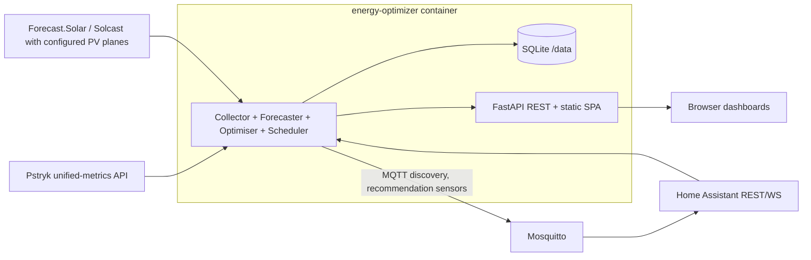

# Energy Optimizer — refined plan and design

Status: designed, not started (2026-07-12)

Refines an earlier internal KB note on a Dockerised solar battery optimisation app.
The app is developed in its **own repository** (working name: `energy-optimizer`), shipped as a
Docker image, and later integrated into ansible-nas as a thin Docker role. This document is the
implementation-ready design; it can be copied into the new repo as `DESIGN.md`.

## Review findings vs the KB note

The KB plan is sound: dry-run first, explainability, backtesting, and the oracle backtest already
shows the upside comes from battery export into evening price peaks. The following corrections and
refinements were found during review:

1. **Pstryk API changed on 2026-04-01.** The legacy `integrations/pricing/` and
   `integrations/prosumer-pricing/` endpoints no longer exist. The current API is a single
   unified-metrics endpoint (verified against evcc's fixed integration and the Pstryk swagger):

   ```
   GET https://api.pstryk.pl/integrations/meter-data/unified-metrics/
       ?metrics=pricing&resolution=hour
       &window_start=2026-07-12T00:00:00Z&window_end=2026-07-14T00:00:00Z
   Authorization: *** key, no Bearer prefix>
   ```

   Response: `{ "frames": [...], "summary": {...} }`, with prices in
   `frames[].metrics.pricing.price_gross` (buy) and `.price_prosumer_gross` (sell), plus
   `is_cheap` / `is_expensive` flags. Windows are UTC; convert to Europe/Warsaw locally.
   Swagger: `https://api.pstryk.pl/integrations/swagger/`.

2. **Price horizon is asymmetric and the plan must handle it.** Day-ahead TGE fixing publishes
   tomorrow's hourly prices in the early afternoon (~13:00–15:00 CET). Before publication the
   known-price horizon can be as short as ~10 h. The optimiser must (a) run on whatever horizon has
   real prices, and (b) optionally pad beyond it with a price *forecast* (median-by-hour of last
   7 days) explicitly marked low-confidence. Never present padded hours as real prices in the UI.

3. **Negative prices happen** (sunny PL summer middays). The model must support: PV curtailment as
   a decision variable, avoiding export when sell price ≤ 0, and grid-charging when buy price is
   negative/very low. This also forces MILP (binary) treatment of simultaneous charge/discharge —
   with negative prices, a pure LP can "burn" energy by charging and discharging at once.

4. **Long-term telemetry gap (infrastructure action item, independent of the app).**
   The Home Assistant InfluxDB include-list contains no Sigen entities, and the HA recorder keeps
   only 14 days. Add the Sigen plant sensors (SoC, battery/PV/consumed/grid import/export power,
   EMS mode) to the InfluxDB include list **now** so load/PV history accumulates for forecasting
   and backtests (long-retention bucket).

5. **MQTT is the right HA output path**, not REST sensors. Mosquitto already runs alongside HA.
   Use MQTT discovery so sensors appear automatically with availability tracking (LWT), and
   the app needs no inbound access from HA.

6. **LP/MILP over dynamic programming.** The backtest used DP with 0.2 kWh SoC discretisation.
   For the product, use a MILP solved with HiGHS (via `pulp` or `highspy`): continuous SoC, exact
   constraint handling, trivially extensible (flexible loads, reserve penalties), and a 48-step
   hourly problem solves in milliseconds. Keep the DP only if a solver dependency proves painful.

7. **Do not add distribution fees twice.** A live 2026-07-12 Pstryk response showed that
   `price_gross` / `full_price` already incorporates `service_price`, `dist_price`, VAT and excise
   on top of the TGE component. The default import price is therefore `full_price` (falling back to
   `price_gross`), not `price_gross + distribution_markup`. Persist all returned components and
   support a configurable `import_price_adjustment_pln_kwh` only for invoice components proven to
   be missing. Verify the composition against an actual invoice during dry-run.

8. **Settlement semantics stay an open question but are contained.** Whether
   `price_prosumer_gross` applies exactly to battery-sourced export, and how the prosumer deposit
   nets against the invoice, must be verified against a real invoice before controlled mode. Until
   then the savings dashboard shows both "raw hourly" and "invoice-model" valuations.

9. **Aggregate battery variables are insufficient.** Use explicit source/destination flows
   (`pv_to_load`, `pv_to_battery`, `pv_to_grid`, `grid_to_load`, `grid_to_battery`,
   `battery_to_load`, `battery_to_grid`). This makes battery-export and grid-charge feature flags
   exact instead of accidentally disabling all export. Separate binaries prevent simultaneous
   charge/discharge and simultaneous grid import/export.

10. **Time-step duration is explicit.** Every interval carries `dt_hours`; power (kW) is converted
    to interval energy (kWh) before SoC/accounting equations. Use aligned 15-minute steps so a run
    part-way through an hour never optimises elapsed time as if it were future.

11. **Startup history and PV forecasts need real bootstrap inputs.** App SQLite is empty on first
    start, HA recorder has only 14 days, and no dedicated Forecast.Solar/Solcast entity was found
    during live review. Phase 0 is mandatory. Support an optional one-off InfluxDB backfill, and
    require configured PV-array geometry rather than treating a weather entity as a PV forecast.

## System context

| Asset | Value |
|---|---|
| PV | ~7 kWp, observed peak ~5.75 kW |
| Battery | Sigen, 18.08 kWh rated, 8.8 kW charge / 9.6 kW discharge limits |
| HA | reachable on the LAN, Sigenergy-Local-Modbus (HACS) entities live |
| Pricing | Pstryk, hourly dynamic, unified-metrics API; live 48-frame horizon verified 2026-07-12 |
| Infra | NAS host: HA, Mosquitto, InfluxDB, Traefik, ansible-nas managed |

Key HA entities (read-only in MVP):

```
sensor.sigen_plant_battery_state_of_charge
sensor.sigen_plant_battery_power
sensor.sigen_plant_pv_power
sensor.sigen_plant_consumed_power
sensor.sigen_plant_grid_import_power
sensor.sigen_plant_grid_export_power
sensor.sigen_plant_ems_work_mode
sensor.sigen_plant_rated_energy_capacity
sensor.sigen_plant_ess_rated_charging_power
sensor.sigen_plant_ess_rated_discharging_power
```

## Architecture

Single container, Python backend, embedded scheduler, SQLite state, static SPA frontend served by
the same process. No external services beyond HA, Pstryk, forecast provider, and MQTT.



Internal modules (single Python package `energy_optimizer`):

| Module | Responsibility |
|---|---|
| `config.py` | Pydantic Settings; all config via env vars / env file |
| `ha_client.py` | HA REST: live states, history API; retry + staleness detection |
| `pstryk_client.py` | unified-metrics client; caching; known-price-horizon reporting |
| `forecast/pv.py` | Forecast.Solar/Solcast using configured PV planes + recent-error correction |
| `forecast/load.py` | rolling median by (hour, weekday/weekend) from stored history |
| `forecast/price.py` | price padding beyond known horizon (marked low-confidence) |
| `optimiser.py` | duration-aware explicit-flow MILP + HiGHS; returns plan + constraint metadata |
| `simulator.py` | replay engine: applies a policy to a historical series (backtests, counterfactuals) |
| `policies.py` | baseline policies: pv-only, self-consumption, actual-sigen (from telemetry) |
| `accounting.py` | cost/value calculation, degradation cost, invoice model |
| `explain.py` | deterministic reasons from selected flows and binding constraints; LP-relaxation metadata is advisory |
| `safety.py` | rule checks; produces blockers/warnings; owns `control_enabled` (always false in MVP) |
| `scheduler.py` | APScheduler jobs: collect (1 min), prices (15 min), optimise (15 min), daily report (00:15) |
| `store.py` | SQLite via SQLAlchemy; migrations via Alembic |
| `mqtt_publish.py` | MQTT discovery config + state publishing, LWT availability |
| `web/` | FastAPI routes + serves `frontend/dist` |

Frontend: Vite + React + TypeScript + ECharts, built into static files at image build time. No
frontend server, no SSR — the SPA only consumes the app's own REST API.

## Storage schema (SQLite, `/data/energy_optimizer.sqlite`)

```
telemetry(ts, soc_pct, batt_charge_kw, batt_discharge_kw, pv_kw, load_kw, grid_import_kw,
          grid_export_kw, ems_mode, stale bool)
prices(interval_start, tge, service, distribution, excise, vat, base, buy_gross, full_price,
       sell_gross, source {api|forecast}, fetched_at)
forecasts(run_id, interval_start, kind {pv|load|price_buy|price_sell}, value, confidence)
runs(run_id, ts, mode, horizon_hours, known_price_hours, input_state json,
     solver_input json, solver_input_schema, solver_input_sha256, objective_pln,
     status {ok|blocked|low_confidence}, reason, safety json, solve_ms)
plan_steps(run_id, interval_start, dt_hours, pv_to_load_kwh, pv_to_battery_kwh, pv_to_grid_kwh,
           grid_to_load_kwh, grid_to_battery_kwh, battery_to_load_kwh,
           battery_to_grid_kwh, curtail_kwh, soc_pct_end, marginal_value)
daily_reports(date, actual_cost_pln, optimizer_sim_cost_pln, pvonly_cost_pln, selfcons_cost_pln,
              missed_opportunity_pln, actual_import_kwh, actual_export_kwh, battery_cycles,
              degradation_cost_pln, pv_forecast_mae_kwh, load_forecast_mae_kwh, forecast_error_cost_pln)
```

`runs` + `plan_steps` are the audit log. `solver_input` is an immutable, versioned snapshot of all
normalised telemetry, forecasts, prices, interval durations, battery/tariff parameters, feature
flags and solver version used by the run; its SHA-256 detects mutation. Mutable price-cache rows
alone are never used as the reproducibility record.
Retention: raw telemetry downsampled to 5-min after 90 days; everything else kept indefinitely
(SQLite stays small). Continuous InfluxDB export is **not** an app concern — HA already ships
entities there — but an optional read-only startup backfill is supported.

## Optimisation model

Rolling-horizon MILP using aligned 15-minute steps and re-running every 15 minutes. Hourly provider
prices and initial forecasts are expanded to quarter-hours without inventing sub-hourly variation.
Each interval has `dt_hours` (normally 0.25); equations operate on kWh, not mixed kW/kWh units.

Decision variables per interval: `soc`, explicit flows `pv_to_load`, `pv_to_battery`, `pv_to_grid`,
`grid_to_load`, `grid_to_battery`, `battery_to_load`, `battery_to_grid`, `curtail`, and binaries
`is_charging` and `is_importing`.

Objective (minimise):

```
Σ_t  grid_import[t] * (full_price[t] + import_price_adjustment[t])
   - grid_export[t] * sell_price[t]
   + (battery_charge_energy[t] + battery_discharge_energy[t])
        * degradation_cost_pln_kwh_throughput
   + reserve_shortfall_penalty[t]
```

Core constraints (all flows are non-negative interval energies):

```
PV allocation:       pv_to_load + pv_to_battery/η_c + pv_to_grid + curtail = pv_energy
load supply:         pv_to_load + grid_to_load + battery_to_load*η_d = load_energy
battery dynamics:    soc[t+1] = soc[t] + pv_to_battery + grid_to_battery
                                  - battery_to_load - battery_to_grid
grid import:         grid_import = grid_to_load + grid_to_battery/η_c
grid export:         grid_export = pv_to_grid + battery_to_grid*η_d
bounds:              soc_min ≤ soc[t] ≤ soc_max       (20% / 98% default)
charge limit:        pv_to_battery + grid_to_battery
                       ≤ max_charge_kw * dt_hours * is_charging
discharge limit:     battery_to_load + battery_to_grid
                       ≤ max_discharge_kw * dt_hours * (1-is_charging)
grid direction:      grid_import ≤ site_import_limit_kw * dt_hours * is_importing
                     grid_export ≤ site_export_limit_kw * dt_hours * (1-is_importing)
options:             battery_to_grid = 0 if battery export disabled
                     grid_to_battery = 0 if grid charging disabled
```

Also constrain the combined inverter output where required by the Sigen/site hardware. Site import,
export and inverter limits are required configuration; do not infer them from battery ratings.

η_c = η_d = √0.90. Degradation starts at 0.05 PLN per kWh of total battery-side throughput, with
no implicit `/2`; any equivalent-cycle convention requires a separately named setting. The two
binaries prevent simultaneous charge/discharge and import/export arbitrage under negative prices.

Sigen sign normalisation is explicit and fixture-tested: live verification showed
`sensor.sigen_plant_battery_power > 0` while charging and `< 0` while discharging. Internally,
charge and discharge are separate non-negative values.

Terminal policy: if the horizon is short or mostly padded, preserve at least the starting SoC.
Otherwise value terminal SoC using a conservative configured salvage value. Keep emergency reserve,
normal economic reserve and optional outage/weather reserve conceptually separate.

Explainability is deterministic from selected flows, binding constraints and price structure, e.g.
*"Hold charge: export spread to 19:00–21:00 exceeds current sell value plus losses"*. Optional LP
relaxation duals may populate `marginal_value`, but are not the authoritative explanation for an
integer solution.

## Forecasting (MVP)

- **PV**: Forecast.Solar or Solcast with latitude/longitude and one or more configured planes
  (`peak_kwp`, tilt/declination, azimuth, inverter limit); corrected by a capped actual/forecast
  ratio over the trailing 3 h. `weather.forecast_dom` is not treated as a PV forecast.
- **Load**: median by (hour-of-day, weekday/weekend) over trailing 28 days from `telemetry`;
  fallback to HA recorder history on first runs (only 14 days available). An optional read-only
  InfluxDB bootstrap client can backfill deeper history after Phase 0; otherwise insufficient
  history is explicitly low-confidence.
- **Price padding**: startup backfills 14–30 days of Pstryk prices. Beyond the known horizon,
  median by local hour requires a minimum sample count; otherwise use a conservative fallback.
  Padded buy/sell prices are separate and low-confidence. Grid charging and battery export are
  disabled by default when expected profit depends on padded prices.
- Every forecast is stored per run, so forecast error is measurable per day (feeds
  `daily_reports`).

## Safety rules (modelled from day one, enforced even in dry-run)

- Never plan discharge below reserve SoC (default 20%).
- Battery export only if spread > losses + degradation + `minimum_export_spread` (0.30 PLN/kWh).
- Grid charging only if future value > true buy cost + losses + degradation + margin (0.30 PLN/kWh).
- No cycling for gains below degradation cost.
- Fast power telemetry stale (> 5 min) → `blocked`; SoC uses a 10-minute threshold. Static rated
  values and EMS mode must be readable but are not stale merely because their state did not change.
- Missing Pstryk prices for current hour → `blocked`.
- Missing PV/load forecast → `low_confidence`, recommendation published with warning.
- `control_enabled` is hardcoded false in MVP; the flag and rate-limit scaffolding exist so
  controlled mode inherits them.

## HA integration (MQTT discovery)

Discovery prefix `homeassistant`, node `energy_optimizer`, availability via LWT on
`energy_optimizer/status`. Published entities:

```
sensor.energy_optimizer_next_action              (idle|charge|discharge|export|grid_charge|curtail)
sensor.energy_optimizer_next_action_power_kw
sensor.energy_optimizer_target_soc
sensor.energy_optimizer_expected_profit_today
sensor.energy_optimizer_actual_cost_today
sensor.energy_optimizer_missed_opportunity_today
sensor.energy_optimizer_decision_reason
sensor.energy_optimizer_confidence               (ok|low_confidence|blocked)
binary_sensor.energy_optimizer_control_enabled   (always off in MVP)
```

Retain discovery and current state where appropriate and republish after reconnect. Configure MQTT
username/password, TLS toggle, discovery prefix and unique client ID; never assume anonymous access.
Use the broker host IP:1883 initially unless the role deliberately joins the `homeassistant` Docker network.

## REST API (consumed by the SPA; also usable from HA REST sensors as fallback)

```
GET /api/status            current telemetry, prices, mode, last run summary
GET /api/plan              latest plan steps + forecasts + known-price horizon marker
GET /api/runs?date=        audit log
GET /api/reports/daily     daily_reports rows
POST /api/backtest         {start, end, policies[], battery_overrides} → comparison table
GET /healthz               liveness (used by Docker healthcheck)
```

## UI (three views, answers "what / why / how much / can I trust it")

1. **Now**: live power flows (PV, load, battery, grid), SoC gauge, current buy/sell price,
   Sigen EMS mode, app mode badge (`dry_run`), next action + reason + expected value.
2. **Plan**: 48 h chart — buy/sell price curves (real vs padded shaded), PV and load forecast
   bands, planned SoC trajectory, planned import/export bars; cumulative expected cost line.
3. **Savings**: daily table + cumulative chart of actual vs optimiser-simulated vs PV-only vs
   self-consumption counterfactuals; missed opportunity; battery cycles and degradation cost;
   forecast error cost. This is the view that decides whether the app ever earns control.

## App repository layout

```
energy-optimizer/
  pyproject.toml            # uv/hatch; deps: fastapi, uvicorn, pydantic-settings, sqlalchemy,
                            # alembic, apscheduler, httpx, paho-mqtt, pulp (HiGHS), pandas
  src/energy_optimizer/     # modules as in Architecture table
  frontend/                 # Vite + React + TS + ECharts
  tests/                    # pytest; optimiser golden tests, simulator vs backtest CSVs,
                            # pstryk/ha clients against recorded fixtures (respx)
  Dockerfile                # multi-stage: node build of frontend → python slim runtime
  compose.dev.yml           # local dev against real HA/Pstryk (read-only, safe)
  DESIGN.md                 # this document
```

CI (GitHub Actions): lint (ruff), type-check (mypy), pytest, then build amd64. Add other
architectures only after CI proves compatible HiGHS wheels; push to GHCR on tag. The existing oracle-backtest CSV files become regression fixtures:
the new `simulator.py` must reproduce the oracle backtest numbers within tolerance.

## Ansible-nas integration (after the image exists)

Thin role `roles/energy_optimizer`, standard ansible-nas shape (defaults / tasks / docs /
molecule), pulling the GHCR image — no local build:

```yaml
# defaults/main.yml (excerpt)
energy_optimizer_enabled: false
energy_optimizer_available_externally: false
energy_optimizer_container_name: energy-optimizer
energy_optimizer_image_name: ghcr.io/<owner>/energy-optimizer
energy_optimizer_image_version: latest
energy_optimizer_port: "8320"
energy_optimizer_directory: "{{ docker_home }}/energy-optimizer"   # mounted at /data
energy_optimizer_memory: 768m       # profile first; reduce to 512m if safe
energy_optimizer_mode: dry_run
energy_optimizer_ha_url: "http://{{ ansible_nas_ip }}:{{ homeassistant_port }}"
energy_optimizer_ha_token: ""          # wire to homeassistant_access_token in host config
energy_optimizer_pstryk_api_key: ""    # wire to pstryk_api_key in host config
energy_optimizer_mqtt_host: "{{ ansible_nas_ip }}"
energy_optimizer_mqtt_port: "{{ mosquitto_port_a }}"
energy_optimizer_mqtt_username: ""
energy_optimizer_mqtt_password: ""
energy_optimizer_mqtt_tls: false
energy_optimizer_influxdb_bootstrap_enabled: false
```

The host config (in your private ansible-nas inventory) reuses existing secrets — no duplication:

```yaml
energy_optimizer_enabled: true
energy_optimizer_ha_token: "{{ homeassistant_access_token }}"
energy_optimizer_pstryk_api_key: "{{ pstryk_api_key }}"
```

Container env: `EO_MODE=dry_run`, `EO_HA_URL`, `EO_HA_TOKEN`, `EO_PSTRYK_API_KEY`, `EO_MQTT_*`,
PV-plane/site-grid settings, optional read-only InfluxDB bootstrap settings,
`EO_DB=/data/energy_optimizer.sqlite`, `TZ=Europe/Warsaw`. Run non-root with one Uvicorn process
(to avoid duplicate APScheduler jobs), SQLite WAL/busy timeout, graceful shutdown and a documented
`/data` backup policy. Traefik labels only if `available_externally` (keep internal initially).

## Implementation phases

**Phase 0 — prep (in the infrastructure config repo, do now, no app code)**
Add all power/SoC/EMS/rating Sigen entities listed above to
`homeassistant_influxdb_include_entities` and redeploy the homeassistant role. Capture PV plane
geometry plus site import/export and combined inverter limits as configuration prerequisites.

**Phase 1 — data spine (app repo)**
Repo scaffold, config, SQLite store, `pstryk_client` (unified-metrics plus historical price
bootstrap), `ha_client`, optional InfluxDB history bootstrap, collector scheduler job. Exit: container runs on a laptop against live HA/Pstryk, telemetry and prices land
in SQLite, `/api/status` works.

**Phase 2 — optimiser + simulator**
Explicit-flow, duration-aware MILP optimiser, policies, simulator, accounting. Exit: `POST /api/backtest` reproduces the
2026-06-25→07-09 oracle backtest numbers within tolerance; golden tests in CI.

**Phase 3 — forecasts + live dry-run loop**
PV/load/price-padding forecasters, 15-min optimise job, runs/plan_steps audit log, explain +
safety, MQTT discovery publishing. Exit: HA shows dry-run sensors updating; every run auditable.

**Phase 4 — UI + daily reports**
SPA with Now/Plan/Savings views, daily report job. Exit: savings dashboard shows day-by-day
actual vs counterfactuals with forecast error attribution.

**Phase 5 — deploy via ansible-nas**
GHCR publishing, `energy_optimizer` role, host config. Exit: running on the NAS host in dry_run.

**Phase 6 — shadow-mode validation (≥ 2 weeks, no code)**
Dry-run exit criteria before even designing assisted/controlled mode:
- ≥ 14 daily reports with status ok;
- forecast-based simulated plan beats actual Sigen behaviour cumulatively and on ≥ 60% of days;
- PV forecast MAE < 15% of daily PV energy; load MAE < 20%;
- Pstryk settlement semantics verified against a real invoice (prosumer price for battery export,
  distribution fees in buy price);
- recommendations judged understandable via the reason strings.

**Phase 7 — assisted mode design (separate plan)**
Only after Phase 6 passes. Requires answers to: which Sigen entities/services allow safe control,
whether explicit charge/discharge power setpoints exist vs only EMS modes/time windows, and
battery-to-grid export control. Out of scope here.

## Open questions carried into implementation

1. Pstryk settlement: is `price_prosumer_gross` applied 1:1 to battery-sourced export, and how does
   the prosumer deposit net monthly? (verify with invoice during Phase 6)
2. Exact variable distribution components for the buy-price model (OSD tariff, G12e question).
3. Should the objective target monthly invoice minimisation rather than raw daily value once the
   deposit mechanics are known?
4. Forecast.Solar free tier adequacy vs Solcast for a ~7 kWp single-plane array.
5. Sigen control surface (Phase 7 gate — listed above).
6. Exact site grid import/export and combined inverter limits.
7. PV array planes: per-plane peak power, tilt and azimuth; Forecast.Solar vs Solcast.
8. MQTT authentication policy (dedicated credentials preferred over anonymous).
