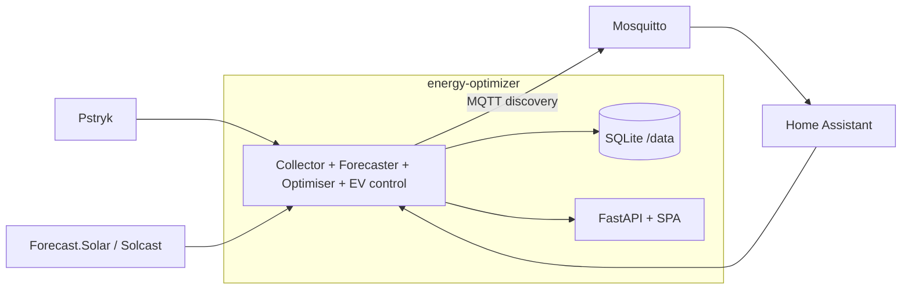

# Energy Optimizer — design

Status: implemented dry-run + opt-in EV relay control (updated 2026-08-03).

Dockerised solar/battery optimisation app (`energy-optimizer` / PvOpti repo), shipped as
an image and deployed by the ansible-nas `energy_optimizer` role. Sigen battery control
stays dry-run; EV/PHEV charger relay control is a separate opt-in.

## System context

| Asset | Value |
|---|---|
| PV | ~7 kWp |
| Battery | Sigen, 18.08 kWh, 8.8 kW charge / 9.6 kW discharge |
| Site | Sigen Hybrid 6.0 TP2 defaults: import 11 kW, export 6.6 kW, inverter 6.0 kW |
| Pricing | Pstryk unified-metrics (hourly); asymmetric day-ahead horizon |
| Infra | HA, Mosquitto, optional InfluxDB bootstrap, Traefik |

Key HA entities (Sigen, read-only):

```
sensor.sigen_plant_battery_state_of_charge
sensor.sigen_plant_battery_power
sensor.sigen_plant_pv_power
sensor.sigen_plant_consumed_power
sensor.sigen_plant_grid_import_power
sensor.sigen_plant_grid_export_power
sensor.sigen_plant_ems_work_mode
```

EV entities are configured via `EO_EV_*` (switch, power, SoC, charging status/active,
charge-to-100 input, fault binaries).

## Architecture

Single container: Python backend, embedded scheduler, SQLite, SPA served by FastAPI.


```mermaid
flowchart LR
  pstryk[Pstryk] --> core
  ha[Home Assistant] --> core
  fcst[Forecast.Solar / Solcast] --> core
  subgraph container [energy-optimizer]
    core[Collector + Forecaster + Optimiser + EV control] --> db[(SQLite /data)]
    core --> api[FastAPI + SPA]
  end
  core -->|MQTT discovery| mqtt[Mosquitto] --> ha
```

| Module | Responsibility |
|---|---|
| `config.py` | Pydantic Settings (`EO_*`) |
| `ha_client.py` | HA REST states/history; staleness |
| `pstryk_client.py` | unified-metrics + history bootstrap |
| `forecast/*` | PV planes, load median, price padding |
| `optimiser.py` | duration-aware explicit-flow MILP (HiGHS/PuLP) |
| `ev.py` / `ev_control.py` | flexible-load plan + fail-safe relay decisions |
| `simulator.py` / `policies.py` / `accounting.py` | backtests and counterfactuals |
| `explain.py` / `safety.py` | reasons; blockers; Sigen `control_enabled` always false |
| `scheduler.py` | collect 1m, EV control 1m, prices/optimise 15m |
| `store.py` | SQLAlchemy SQLite |
| `mqtt_publish.py` | discovery + recommendation sensors |
| `web/` | REST + static SPA |

## Storage (`/data/energy_optimizer.sqlite`)

```
telemetry(...)          # plant power/SoC
ev_telemetry(...)       # vehicle/charger live state
prices(...)             # buy/sell components; source api|forecast
forecasts(...)
runs(...) / plan_steps(...) / ev_plan_steps(...)
ev_control_status(...)  # latest relay decision
daily_reports(...)
```

`runs` + plan tables are the audit log; each run snapshots solver input (SHA-256).

## Optimisation model

Rolling-horizon MILP on aligned 15-minute steps, every 15 minutes. Hourly prices/forecasts
are expanded to quarter-hours. Flows are non-negative interval energies (`pv_to_load`,
`pv_to_battery`, `pv_to_grid`, `grid_to_load`, `grid_to_battery`, `battery_to_load`,
`battery_to_grid`, `curtail`) plus binaries preventing simultaneous charge/discharge and
import/export.

Objective (minimise): grid import cost − export revenue + degradation on battery-side
throughput + reserve shortfall. η_c = η_d = √round-trip. Site import/export/inverter
limits are required config (image defaults match Sigen Hybrid 6.0 TP2).

Sigen `battery_power > 0` while charging, `< 0` while discharging (fixture-tested).

EV flexible load: guarantee `ev_minimum_target_soc_pct` by next `ev_departure_hour`, then
shift remaining charge to forecast solar / cheap grid. Charge-to-100 HA input bypasses
economics for immediate full charge. Relay control is independent of Sigen control.

## Forecasting

- **PV**: Forecast.Solar or Solcast from configured planes; trailing error correction
- **Load**: median by (hour, weekday/weekend) over ~28 days; optional InfluxDB bootstrap
- **Price padding**: beyond known Pstryk horizon, median-by-hour marked low-confidence;
  export/grid-charge gated when profit depends on padded prices

## Safety

- No discharge below reserve SoC; export/grid-charge need configured margins over losses
- Stale power telemetry (>5 min) or missing current-hour prices → `blocked`
- Missing forecasts → `low_confidence`
- Sigen `control_enabled` hardcoded false
- EV: OFF on unplugged/unavailable/unrecognized/fault/target-reached/no-power; verify ON
  in HA with OFF fallback; min on/off from switch `last_changed`

## HA (MQTT discovery)

Node `energy_optimizer`, LWT on `energy_optimizer/status`. Sensors for next action, power,
target SoC, profit/cost, reason, confidence; `binary_sensor` for control_enabled (always off).

## REST / UI

```
GET  /api/status /api/prices /api/plan /api/runs /api/reports/daily
GET  /api/savings /api/comparison/hourly
POST /api/backtest
GET  /healthz
```

SPA views: **Now** (live flows, SoC, prices, EV status, next action) and **Savings**
(counterfactuals, hourly comparison).

## Deployment

ansible-nas `energy_optimizer` role: pull GHCR or build locally from this tree
(`energy_optimizer_build_locally`). Secrets reuse HA token / Pstryk key / MQTT from
inventory. Non-root, single Uvicorn worker, `/data` volume.

## Open questions

1. Pstryk settlement for battery-sourced export vs prosumer deposit (verify on invoice)
2. Whether the objective should target monthly invoice once deposit mechanics are known
3. Forecast.Solar free tier vs Solcast for this array
4. Sigen assisted/controlled mode surface (separate plan; out of scope while dry-run)
