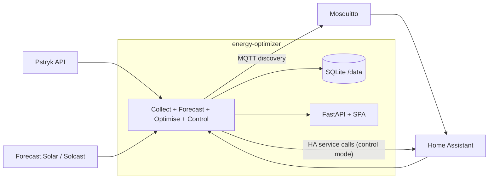

# PvOpti design

Single-site home energy manager for a PV + stationary battery + EV setup on the
Pstryk dynamic-pricing tariff. It plans and (optionally) controls when to charge
and discharge the battery, when to import/export from the grid, and when to run
the EV charger, so that the electricity bill is minimized.

This is the current design document. Historical/superseded design and plan
documents live in [`archive/`](./archive/). The only other authoritative
reference is the empirically verified
[`sigenergy-control-contract.md`](./sigenergy-control-contract.md).

## Premise

- One house, one operator. Not multi-tenant, not a product for third parties.
- The optimiser always runs and produces a plan. Acting on that plan (writing to
  the inverter) is a separate, switchable capability.
- Getting the economics slightly wrong is acceptable. The goal is to save money,
  not to be provably optimal. A bad decision costs a few złoty, not hardware.
- Equipment safety is owned by the inverter and battery BMS, not by this app. See
  [Safety model](#safety-model).

## Site context

| Asset | Value |
|---|---|
| PV | ~7 kWp |
| Battery | Sigen, 18.08 kWh, 8.8 kW charge / 9.6 kW discharge |
| Inverter/site | Sigen Hybrid 6.0 TP2: import 11 kW, export 6.6 kW, inverter 6.0 kW |
| Pricing | Pstryk dynamic hourly tariff (day-ahead horizon, asymmetric) |
| Infra | Home Assistant, Mosquitto (MQTT), optional InfluxDB bootstrap, reverse proxy |

Battery/PV/SoC/power come from Home Assistant (Sigen integration), read-only:

```
sensor.sigen_plant_battery_state_of_charge
sensor.sigen_plant_battery_power          # >0 charging, <0 discharging
sensor.sigen_plant_pv_power
sensor.sigen_plant_consumed_power
sensor.sigen_plant_grid_import_power
sensor.sigen_plant_grid_export_power
sensor.sigen_plant_ems_work_mode
```

EV entities (charger switch, power, SoC, charging status, faults, charge-to-100
input) are configured through `EO_EV_*`.

## Architecture

One container: Python backend + embedded APScheduler + SQLite, serving a React
SPA through FastAPI. Runs as a single Uvicorn worker because the process owns the
in-process scheduler.



| Module | Responsibility |
|---|---|
| `config.py` | Pydantic Settings (`EO_*`), site/battery limits, control gates |
| `service.py` | Orchestration: collect telemetry/prices, optimise, EV + battery control, MQTT publish |
| `scheduler.py` | Jobs: collect 1m, EV 1m, battery cadence, heartbeat, prices 15m, optimise on the quarter |
| `optimiser.py` | Rolling-horizon MILP (PuLP/HiGHS) on 15-minute steps |
| `forecast/*` | PV (Forecast.Solar/Solcast), load (settled-history median), price padding |
| `ev.py` / `ev_control.py` | EV flexible-load plan + fail-safe relay decisions |
| `battery_control.py` | Turns the current plan interval into a bounded battery intent (no I/O) |
| `sigenergy_control.py` | Ordered Remote-EMS transaction via HA + physical read-back verification |
| `safety.py` | Plan status + independent `control_authorized` gate |
| `ha_client.py` | HA state/history reads and controlled service calls |
| `pstryk_client.py` | Dynamic prices + settled meter intervals |
| `control_store.py` | Control audit log, single-owner lease, lockout state |
| `watchdog.py` | Heartbeat health for the independent HA OFF-only fallback |
| `store.py` | SQLAlchemy SQLite persistence |
| `mqtt_publish.py` | HA MQTT discovery + recommendation/control sensors |
| `simulator.py` / `policies.py` / `accounting.py` | Backtests and cost accounting |
| `web/` | FastAPI REST + OIDC + SPA hosting |

## Data flows

- **Live telemetry**: Home Assistant (Sigen) → `telemetry` / `ev_telemetry`.
- **Prices**: Pstryk dynamic prices (buy/sell) → `prices`; beyond the known
  horizon, prices are padded with a median-by-hour and flagged low-confidence.
- **Billing truth**: settled Pstryk import/export is the *sole* source for billed
  energy, savings, backtests, and historical load calibration. The app does not
  substitute Sigen grid counters or zero-fill missing settled intervals; an
  incomplete hour is reported as incomplete.
- **Forecasts**: PV from Forecast.Solar/Solcast with trailing error correction;
  load from a median by (hour, weekday/weekend) over ~28 days.

### Storage (`/data/energy_optimizer.sqlite`)

```
telemetry / ev_telemetry            # live plant + vehicle state
prices                              # buy/sell components; source api|forecast
forecasts
runs / plan_steps / ev_plan_steps  # audit log; each run snapshots solver input (SHA-256)
ev_control_status                  # latest relay decision
control_actions / controller_state / controller_lease
daily_reports
```

## Optimisation model

Rolling-horizon MILP over aligned 15-minute steps, re-solved every 15 minutes.
Hourly prices and forecasts are expanded to quarter-hours. Decision variables are
non-negative interval energies split by source and destination (PV/grid/battery →
house, EV, battery, or grid) plus curtailment, with binaries preventing
simultaneous charge/discharge and simultaneous import/export.

Objective (minimise): grid import cost − export revenue + battery-throughput
degradation cost + reserve-shortfall penalty. One-way efficiencies are
`√round_trip`. Site import/export/inverter limits are required config (defaults
match the Sigen Hybrid 6.0 TP2).

The model already supports the full target behavior: grid-import charging for
price arbitrage (`allow_grid_charging`), battery discharge to house, and battery
export to grid (`allow_battery_export`). These planner flags decide what the plan
may *recommend*; a separate set of control gates decides what may actually be
*actuated* (see below).

**EV**: guarantee `ev_minimum_target_soc_pct` by `ev_departure_hour`, then shift
remaining charge into forecast solar / cheap grid slots. A charge-to-100 HA input
bypasses economics for an immediate full charge. EV relay control is independent
of battery control.

## Control: dry-run vs live

`EO_MODE` selects the battery-actuation posture:

- **`dry_run` (default)**: the optimiser runs, battery intents are computed and
  recorded as `shadow` actions, and recommendations are published over MQTT — but
  nothing is written to the inverter.
- **`control`**: the same intents are actuated through Home Assistant
  (Remote EMS), subject to the safety gates.

EV relay control is separate: it is governed by `EO_EV_CONTROL_ENABLED` and works
regardless of `EO_MODE`. (A future simplification will align EV and battery under
one consistent enable + `EO_MODE` scheme; see the roadmap.)

## Safety model

The guiding principle: **the inverter and battery BMS are the equipment-safety
authority.** They have independent over-voltage/current/temperature protection
and SoC hard limits. This app cannot physically damage the battery through normal
Remote-EMS commands; the worst realistic app-level failure is a suboptimal bill
or unnecessary battery cycling. The software safety layer therefore exists to
avoid *runaway/nonsense actuation* and to always leave the inverter in a known
good state — not to act as a certified safety system.

### Kept (prevents runaway, leaves equipment in a known state)

- **Ordered Remote-EMS transactions with restore-to-known-limits.** Commands are
  applied in the verified order from the control contract, and on
  fallback/shutdown the inverter is returned to explicit local limits
  (8.8 kW / 9.6 kW, 100% / 0% cutoffs) and local self-consumption — never to
  whatever HA happened to report.
- **Physical read-back verification.** The Sigen HA integration has a known
  read-back defect, so success requires observing the actual power/mode response,
  not an HTTP 200 or a displayed `0.0`.
- **Independent OFF-only watchdog.** A heartbeat-driven HA fallback can force the
  inverter back to local control if the app stops; it can only turn Remote EMS
  *off*, never on.
- **Single-owner lease.** Only one controller instance may actuate at a time.
- **Fail-closed on stale inputs.** Missing/stale telemetry, SoC, prices, or plan
  → no economic actuation (fallback only).
- **Manual intervention wins.** Operator/manual changes at the inverter take
  precedence over the app.
- **FSM discipline.** No direct charge↔discharge flip; transitions pass through
  idle/fallback.

### Dropped (economic-risk theater, removed or slated for removal)

- Magic arm-token string and HA-version-pinned "ack evidence ID" required to
  enter control mode.
- Multi-document, ceremony-based authorization to progress the roadmap.
- Gates that require a real incident to occur before a stage may begin.
- Persistent lockouts that require manual database edits to clear after a
  recoverable fault (to become auto-recovering backoff with a manual-clear
  action).

The concrete code changes implementing this simplification are specified in
[`ROADMAP.md`](./ROADMAP.md) (Stage 0).

## Web / auth

FastAPI serves the SPA and a read-oriented REST API:

```
GET  /api/status /api/prices /api/plan /api/runs /api/reports/daily
GET  /api/savings /api/comparison/hourly
GET  /api/control/actions /api/control/shadow-observations
POST /api/backtest
GET  /healthz
```

SPA views: **Dashboard** (live flows, SoC, prices, plan, EV panel, battery
control status) and **Savings** (settled actual-vs-optimiser comparison and
interactive backtest).

OIDC is **optional**. With `OIDC_ENABLED` unset the app is open (dev). In
production it sits behind the operator's reverse proxy and can additionally use
Authentik OIDC (`OIDC_ENABLED`, `APP_URL`, `SESSION_SECRET`, …). OIDC variables
are read without the `EO_` prefix.

## Deployment

Docker-first, single container, non-root, single Uvicorn worker, `/data` volume
for SQLite. Deployed via the ansible-nas `energy_optimizer` role (GHCR pull or
local build). Config comes entirely from `EO_*` env vars; see
[`.env.example`](../.env.example).
